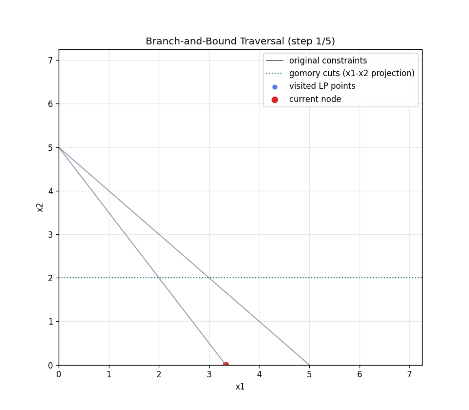
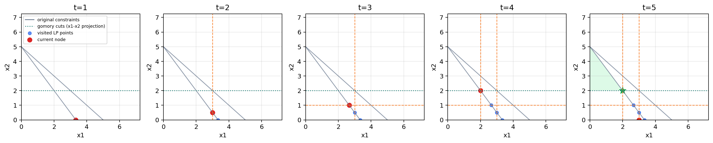

# Solver: LP/IP Optimization Engine

A practical LP/IP solver with YAML-first workflows, exact optimization, and visual analytics.

| Branch-and-Bound Animation | Paper-Ready Timeline |
|---|---|
|  |  |

## Why This Repo

- YAML-first modeling: define objective and constraints once, run directly.
- Exact IP solving: branch-and-bound + Gomory fractional cuts + heuristics.
- Visual explainability: GIF animation and left-to-right timeline figure for papers.
- Built-in baselines: Genetic Algorithm and Greedy solvers for comparison.

## Recommended Workflow (Primary)

Use solve_yaml.py as the default entrypoint.

```bash
python examples/solve_yaml.py <your_problem.yaml>
```

This is the fastest way to:

- parse model + config from YAML,
- solve LP/IP with the exact solver,
- optionally generate visualization artifacts.

## Environment Setup

### 1. Python

- Python 3.9+

### 2. Install dependencies

```bash
pip install -r requirements.txt
```

## Run Cases

### A. Basic LP

```bash
python examples/solve_yaml.py examples/problem_lp.yaml
```

What it demonstrates:

- LP max objective,
- standard <= constraints,
- primal simplex default flow.

### B. Basic IP

```bash
python examples/solve_yaml.py examples/problem_ip.yaml
```

What it demonstrates:

- integer optimization,
- branch-and-bound,
- rounding/diving heuristics.

### C. 6-variable LP

```bash
python examples/solve_yaml.py examples/problem_lp_6vars.yaml
```

What it demonstrates:

- medium-size LP input,
- YAML scalability beyond toy 2-variable examples.

### D. 6-variable IP

```bash
python examples/solve_yaml.py examples/problem_ip_6vars.yaml
```

What it demonstrates:

- medium-size integer model,
- exact solve behavior under larger combinatorial space.

### E. Visualization Demo (2-variable IP)

```bash
python examples/solve_yaml.py examples/problem_ip_vis.yaml
```

What it demonstrates:

- GIF traversal output,
- timeline figure output,
- branch lines + Gomory cut projection + final feasible region.

Default outputs:

- examples/outputs/problem_ip_vis_bnb.gif
- examples/outputs/problem_ip_vis_timeline.png

### F. Stress Test (min objective, equality constraints)

```bash
python examples/solve_yaml.py examples/problem_ip_stress_test.yaml
```

What it demonstrates:

- minimization objective,
- equality constraints normalized internally,
- exact IP solve on assignment-like structure.

## YAML Model Format

### Structured format (recommended)

```yaml
problem:
  objective:
    sense: max          # max or min
    coefficients: [3, 2]
  constraints:
    - coefficients: [2, 1]
      sense: <=         # <=, >=, ==
      rhs: 18

config:
  is_integer: false
  integer_indices: [0, 1]
  lp_method: primal     # primal or dual
  epsilon: 1.0e-9
  max_iterations: 10000
  max_nodes: 50000

  use_rounding_heuristic: true
  rounding_max_repair_steps: 100

  use_gomory_cuts: true
  max_gomory_cuts_per_node: 1

  visualize: false
  visualization_output: outputs/bnb_animation.gif
  visualization_timeline_output: outputs/bnb_timeline.png
  visualization_generate_timeline: true
  visualization_timeline_panels: 6
  visualization_fps: 2
  visualization_grid_size: 160
  max_trace_nodes: 8000
```

### Compact format

```yaml
problem:
  c: [5, 3]
  A:
    - [1, 1]
    - [15000, 10000]
  b: [5, 50000]
  sense: max

config:
  is_integer: true
  integer_indices: [0, 1]
```

## Optional Baselines

### Genetic Algorithm baseline

```bash
python examples/solve_yaml_ga.py examples/problem_ip_stress_test.yaml
```

### Greedy baseline (with exploration cost logs)

```bash
python examples/solve_yaml_greedy.py examples/problem_ip_stress_test.yaml
```

### Compare exact vs GA

```bash
python examples/compare_exact_vs_ga.py examples/problem_ip_stress_test.yaml
```

### Compare exact vs GA vs Greedy

```bash
python examples/compare_exact_ga_greedy.py examples/problem_ip_stress_test.yaml
```

## Technical Notes (Brief)

- LP engine:
  - primal simplex,
  - dual simplex for warm-start reoptimization.
- IP engine:
  - DFS branch-and-bound,
  - rounding and diving heuristics,
  - Gomory fractional cuts (pure-integer path).
- Objective support:
  - max and min (internally normalized to max when needed).
- Constraint support in YAML:
  - <=, >=, == (normalized to internal <= form).
- Visualization scope:
  - currently for 2-variable IP models,
  - Gomory lines shown as x1-x2 projection.

## Current Scope and Extension Direction

- Canonical internal form: maximize c^T x with Ax <= b and x >= 0.
- Strong baseline set already included: exact + GA + Greedy.
- Future extension candidates:
  - mixed-integer Gomory cuts,
  - richer cut families,
  - stronger primal heuristics and presolve.
